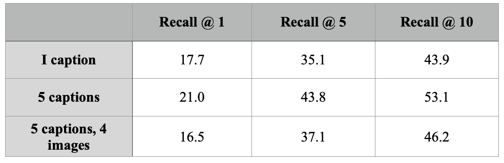

#                                DL2_project
Reproduction of ["Grounding Language Models to Images for Multimodal Generation"](https://arxiv.org/abs/2301.13823)

## SETUP INSTRUCTIONS (from the original paper)
1. Install required libraries  ```src/requirements.txt```
2. Make sure to upgrade ```torch==2.0.0``` when installing (to prevent the incompatibility issues with RTX titan running matrix multiplication on bf16)
3. The visual embeddings for Conceptual Captions images with valid URLs are precomputed and stored at this [URL](https://drive.google.com/file/d/1wMojZNqEwApNlsCZVvSgQVtZLgbeLoKi/view?usp=share_link). These are used to enable the model to retrieve images. The embeddings take up around 3GB, and are compatible with both model configs we provide. Download the files and place ```cc3m_embeddings.pkl``` into the ```src/fromage_model/``` directory.


## MODIFICATION OF ORIGINAL FILES
***models.py***: 
1. added bfloat16 parameter when loading model:
```
self.lm = OPTForCausalLM.from_pretrained(opt_version, torch_dtype=torch.bfloat16)
self.visual_model = CLIPVisionModel.from_pretrained(visual_encoder, torch_dtype=torch.bfloat16)
```
2. added torch.nn.DataParallel to enable multiple GPU (4 GPU) use case (currently commented out since we only use one GPU for now):
```
self.lm = torch.nn.DataParallel(self.lm, device_ids=[0, 1, 2, 3])
self.visual_model = torch.nn.DataParallel(self.visual_model, device_ids=[0, 1, 2, 3])
```


## INSTRUCTIONS TO REPRODUCTION EXPERIMENTS
The experiment we choose to reproduce is Visual Story Telling (see section 4.1 in the paper). VIST dataset used can be found [here](https://visionandlanguage.net/VIST/dataset.html) (Stories of
Images-in-Sequence (SIS)). We preprossed this dataset and converted into a json file named `VIST_data_for_experiments.json` which can be found in `src` folder. The main file to run the experiments 
is named `reproduce.py` and `reproduce.job` is the job file used to run the ```.py``` file in cluster, they can be found in ```src``` folder as well.It includes in total 5050 story sequences and each story 
sequence has 5 images and 5 corresponding story description which form a short story:
```
image_1 - story_1
image_2 - story_2
image_3 - story_3
image_4 - story_4
last_image - story_5
```
The goal of this experiment is to predict the last image based on a few input combinations of previous information (previous images and stories). The following 3 input settings are experimented:
```
1. story_4
2. story_1 + story_2 + story_3 + story_4 + story_5
3. story_1 + image_1 + story_2 + image_2 + story_3 + image_3 + story_4 + image_4 + story_5
```
For each input setting, three different recall levels are also experimented:
```
recall@1 ; recall@5 ; recall@10
```
The results npz files can be accessed using the following 3 keys: images_output, images_target, story_ids, representing images output by the model which is a list of lists; target images to compare with which is a list;
story ids corresponding to all stories which is also a list. The following code can be used to analyze precision of the outcome:
```
import numpy as np

configs = [(1,0,1), (1,0,5), (1,0,10), (5,0,1),(5,0,5),(5,0,10),(5,4,1),(5,4,5),(5,4,10)]
result_dir = ...
for config in configs:
    path = f"{result_dir}/EX1_R{config[2]}_C{config[0]}_I{config[1]}.npz"
    result = np.load(path)
    ids = result['story_ids']
    images = result['images_output']
    targets = result['images_target']
    count = 0
    for j, img in enumerate(images):
        matches = [int(np.array_equal(k, targets[j])) for k in img]
        count += int(sum(matches)>0)
    print(f"{config[0]} captions {config[1]} images at recall {config[2]}: {count*100/1000}%")
```

## INSTRUCTIONS TO EXTENSION EXPERIMENTS
First, the dataset that was used in the extension from the paper ["Multimodal Few-Shot Learning with Frozen Language Model"](https://arxiv.org/abs/2106.13884) needs to be downloaded. The Open-Ended miniImageNet dataset can be found [here](https://fh295.github.io/frozen.html).

#### Next steps:
1. Download the dataset in ```src/datasets``` - you can do this directly by running the command in the folder

```
wget https://storage.googleapis.com/dm-few-shot-learning-benchmarks/open_ended_mi.tar.gz
```


2. Decompress the tar file inside the ```src/datasets``` folder - you can do this by running the following command in the folder

```
tar -xzf open_ended_mi.tar.gz
```

3. Adjust the path to the own root directory in ```src/extension.py```, line 12.
4. Run the job file for the extension ```src/extension.job```. This runs the ```src/run_extension.sh``` which performs all different combinations of experiments (shots, ways, repeats, task induction - all introduced in the paper "Multimodal Few-Shot Learning with Frozen Language Model"). You can do this by running

```
sbatch extension.job
```

5. The results are saved in ```pkl``` files together with ```output logs``` showing the accuracy.


## REPRODUCED RESULTS


Additional results can be found [here](https://drive.google.com/drive/folders/1bS0jdp1VlxhmZ8WWy5SDGkOov98yLV06?usp=share_link)


