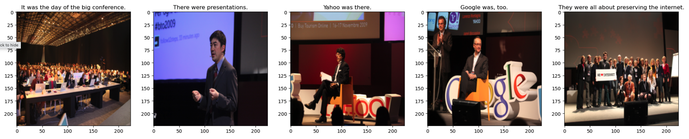
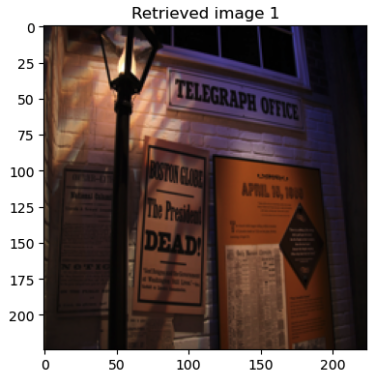
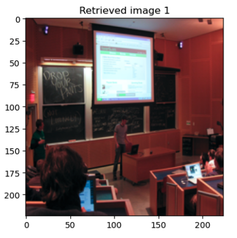
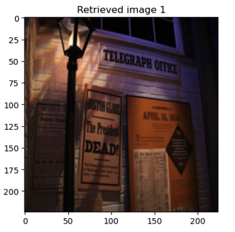
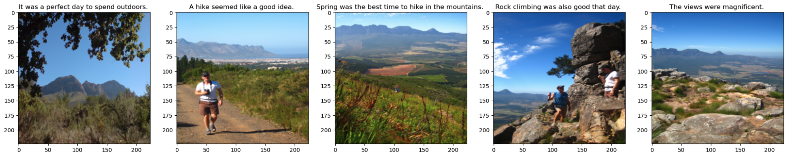
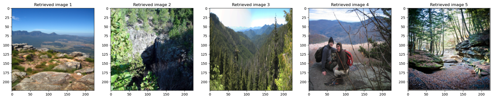
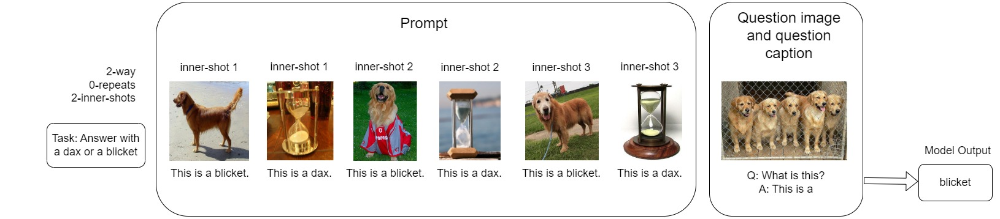

# 1. Introduction

# 1.1 FROMAGe
Large language models (LLM) have demonstrated impressive performance in natural language processing (NLP) tasks, but they lack the ability to utilize visual cues for learning and reasoning about the real world. Additionally, they are unable to generate images, which is a crucial aspect of multimodal communication. A novel approach called FROMAGe [1] is proposed, which leverages a frozen LLM and a visual encoder to enable in-context learning for multimodal tasks. 

FROMAGe uses a frozen LLM and a visual encoder. Both models can produce embeddings of different modalities separately, but they cannot interact with each other to explore multimodal context. FROMAGe proposes a framework for creating an interaction layer between both models. The embeddings generated from the language model are mapped to the visual encoder's vector space using linear transformation to allow LLM to interact with the visual encoder. To generate an embedding for an image using the text input, they propose extending the vocabulary of the LLM with the [RET] token. This represents an embedding of an image from the text input, which is learned during training to map the text space into the image space. They use the contrastive loss to learn the mapping. Moreover, with this approach, learning to generate the [RET] token for multimodal dialogue emerges. Similar to text-visual embedding mapping, they also map the visual embedding to the text space using linear mapping. They use maximum likelihood estimation to learn the mapping.

The paper builds on the shortcomings and prior knowledge that previous work has provided. For example, Flamingo [2] proposed a visual language model for text generation; however, Flamingo cannot generate images. LIMBeR [3] analyzes pretrained vision and language models and finds that learned representations are functionally equivalent up to a linear transform. Therefore, the authors propose to learn linear mappings for both modalities to be able to generate images while reasoning in a multimodal setting.

The FROMAGe model is tested using multimodal tasks, such as image retrieval and image captioning. The results provide evidence that this method is not only feasible for multimodal learning, but it also maintains the existing capabilities of pre-trained text-only LLMs, such as in-context learning and greater sensitivity to input context. FROMAGe can use the additional descriptions to improve retrieval accuracy (9.0 to 10.4 on R@1). When prompted with the full multimodal context (i.e., 5 images and 4 captions), the model can learn in-context to synthesize plausible story-like text. We decided to reproduce image retrieval experiment to further explore the claims made by the FROMAGe paper and gain an understanding of the in-context learning capabilities with multimodal context.

# 1.2 Our Work
In our reproduction we had three different settings, 1 caption, 5 captions, and 5 captions and 4 images. Unlike the claims made by the paper, we found that including 4 images and 5 captions lead to lower recall than 5 captions. We explore the possible reasons for this finding in the discussion section of the post. After reproducing the paper we shifted our focus on the extension.

We decided to explore prompting techniques to exploit the in-context learning capabilities of the FROMAGe model using few-shot learning. Frozen [4] suggests that their work should be seen as a starting point or baseline for the area of research of multimodal few-shot learning. Therefore, we use their paper as a reference for our few-shot learning procedure. In this work, we aim to quantify to what extent the FROMAGe model can adapt to novel and out-of-domain tasks rapidly. Furthermore, we aim to verify that prompting with both visual and language information in few-shot learning is strictly more effective than prompting with language alone.
We utilized the Open-Ended miniImageNet introduced by Frozen to evaluate the performance of FROMAGe in few-shot learning scenarios. Specifically, we employed the 2-way and 5-way few-shot learning tasks using non-existing classes such as ’blicket’ and ’dax,’ which acted as replacements for existing classes like ’dog’ and ’cat.’ Each class was associated with corresponding images and provided to the FROMAGe model as prompts, along with a query image and a question about its class. We varied the number of inner-shots and repeats and evaluated the model’s query performance in terms of accuracy. We compared FROMAGe models' accuracy agains the Frozen.

The results from our extension aligned with the findings of the Frozen paper. We observed that 2-way classification performed better than 5-way classification, as the model had to learn fewer classes. Furthermore, increasing the number of inner-shots and repeats generally led to improved performance, except for the 2-way, 5-inner-shot, 5-repeat and 2-way, 3-inner-shot and 5-repeat scenario.
This could be attributed to the increased input length, which caused the model to struggle with focusing on specific contexts. Moreover, we find that FROMAGe model is less accuracte than the frozen. We also noticed that the accuracy remained below chance level, possibly suggesting that the model did not fully grasp the meaning of the out-of-vocabulary words.

<!-- Regarding your second contribution, comparing the multimodal and text-only few-shot learning capabilities of FROMAGE, what do you expect to find? Do you anticipate that the model will perform better with multimodal prompts, or do you think that language prompts alone will be sufficient for few-shot learning?

Finally, for your third contribution, which benchmark models do you plan to compare FROMAGE against? What metrics will you use to evaluate performance?
] -->

# 2. Reproduction 

In this project, we focused on reproducing the visual storytelling experiment using the VIST dataset, as outlined in section 4.1 in the original paper. Our aim was to evaluate the FROMAGe model's ability to learn in context and transfer knowledge in a zero-shot setting. To streamline the process and save time and computational resources, we chose not to evaluate the CLIP model and instead focused solely on assessing the performance of the FROMAGe model. The experiment comprised three different settings, each varying in the input provided: 1 caption, 5 captions, and 5 captions accompanied by 4 images. Since the FROMAGe model is not generative and relies on an embedding data store to match input embeddings during image retrieval, this posed a challenge. The original precomputed embeddings were cc3m embeddings, which the model was trained on. However, to ensure accurate image retrieval for this specific experiment, the model needed to encode the images from the VIST dataset as well. The paper lacked concrete instructions in this regard. To address this issue, we decided to encode the last image (target image) of each story. This ensured that each precomputed embedding corresponded to a specific story that needed to be predicted. By doing so, we ensured that the total probability across the entire test set summed to one, indicating that no precomputed embeddings were left unused. Additionally, we took the initiative to remove any duplicated target images from the dataset. This step prevented the model from retrieving multiple identical images within a single pass, leading to more diverse and meaningful results.

As a result of the aforementioned ambiguities, the reproduced results deviate to some extent from those reported in the paper. Notably, in the experiments involving inputs with 1 caption and 5 captions, the recall values exhibit a consistent trend. The model performs better when provided with 5 captions compared to just 1 caption across all three recall levels. This suggests that having more context benefits the model in understanding the sequential nature of the story, thereby increasing the probability of retrieving the correct image. However, the results for the input of 5 captions and 4 images do not align with expectations. At recall@1, the performance is even worse than when the model is provided with only 1 caption at the same recall level. On the other hand, at recall@5 and recall@10, it performs better than the model with 1 caption but falls short of the performance achieved with 5 captions. The recall values for all three settings are depicted in the following table:

| |Recall@1|Recall@5|Recall@10|
|:----|:----|:----|:----|
|1 caption|17.7|35.1|43.9|
|5 captions|21.0|43.8|53.1|
|5 captions, 4 images|16.5|37.1|46.2|

It can be seen that overall recall values surpass those reported in the paper. This difference in performance could be attributed to the construction of the precomputed embedding space. In our implementation, we encoded only the target images to serve as the model's search space. Consequently, it becomes relatively easier for the model to retrieve the correct images, potentially leading to higher recall values overall. The following example at recall@1 illustrate the model outputs:

***Original Story:***

***Output -- caption 1 / recall@1:***

***Output -- captions 5 / recall@1:***

***Output -- captions 5, images 4 / recall@1:***

It can be seen from the previous example that model using 5 captions only has the best understanding of story context, therefore the retrieved image is most similar to the ground truth while the other two retrieved the same image. Another example to illustrate outputs at recall@5:

***Original Story:***

***Output -- captions 5 / recall@5:***

Since model can retrieve multiple images to match the target image, the performance is expectedly better than only retrieving one iamge.

There are a couple of potential factors that could explain the discrepancies between our reproduced results and those reported in the paper. One possible reason is the differences in the experimental settings between our reproduction and the original study. For instance, the construction of precomputed embeddings or variations in how recalls are calculated might have an impact on the outcomes. Another aspect to consider is the potential impact of dataset changes. Over time, some URLs associated with the images in the dataset may have become invalid or inaccessible. While we attempted to mitigate this issue by randomly sampling from the entire dataset for our experiments, it is still possible that these changes in the availability of certain images could have influenced the results to some degree, although the likelihood of significant impact is relatively low. Overall, it is essential to acknowledge these factors and consider them when interpreting the differences between our reproduced results and the findings presented in the original paper. 

In conclusion, the FROMAGe model demonstrates a certain degree of effectiveness in contextual learning and zero-shot transfer. Despite the discrepancies observed in the reproduced results, the model generally performs well on the test dataset. For future investigations, it would be valuable to explore the model's capabilities using alternative datasets to assess its similar abilities in different contexts.

## 2.1 Strengths 

1. Effective multimodal generation: 

The model effectively leverages pretrained language models that are available to generate coherent captions for images and relevant multimodal dialogues, since it grounds the language models to images.

2. Training efficiency:

FROMAGe is trained by just finetuning a set of parameters and linearly connecting language model and visual transformer, which makes it easy to train. Although visual and text embeddings are just connected by a rather simple linear network, FROMAGe can clearly understand the contexts of images with their captions. This makes training process much faster, and getting results more efficient.

3. Usage versatility:

FROMAGe is applicable to many different areas, such as captioning, image-text retrieval, multimodal dialogue which shows its broad potential, as it can be fine-tuned and retrained easily as talked in the previous point.

4. Detailed results:

The paper and the code they publish are very clear, which leaves less room for misunderstanding. The background, experiment and analysis are detailed, and shows the strengths and weaknesses of the model based on what they explored. This makes further research on their paper and their model much easier and approachable to other researchers, and shows the researchers' dedication and passion.

## 2.2 Weaknesses

1. Limited exploration of the model:

The paper does not fully explore the capabilities in the model in terms of datasets, hyperparameters and prompting techniques. Especially the lack of datasets and hyperparameters create concerns over the success of the model, makes it seem less adaptable. Testing different hyperparameters could have helped researchers understand it's nature better, and would help further research avoid repetitions. Researching the effects of prompting can be very important, as better use of prompts can influence the final metrics significantly in large language models. This has influenced our research the most here, as we were all intrigued if the models capabilities could have changed without changin the model, and whether it can do in-context learning, which was not explored so far for FROMAGe.

2. Too much reliance on pre-trained models:

Since FROMAGe relies mostly on pre-trained models, it is difficult to understand if the results are more influenced by FROMAGe or the models beneath. The model also inherits all the bias and limitations of the mentioned models, which can create ethical issues. Underlying models should be thoroughly researched and understood, so that the capabilities of FROMAGe are more clear. 

3. Limited analysis on failure:

Although the research is very detailed, there is not much talk about the failures of the model and why it happens besides the appendix. More analysis on the failures could give other researchers a room to explore and improve their findings.

# 3. Our Novel Contribution

After experimenting with the model to reproduce the results in the original paper, we make a novel contribution to the FROMAGe model. Our contribution is to further test the multimodal few-shot learning capabilities of FROMAGe on the Open-ended MiniImageNet dataset that we obtain from the paper "Multimodal Few-Shot Learning with Frozen Language Models" [4]. We wanted to research in-context learning capabilities in order to address the limitation of the exploration range of the model. The Open-ended MiniImageNet dataset consists of images and their corresponding captions. Along with a new dataset, the following terminology is introduced in Frozen: 

Task induction : Include a preceding explanatory text (before the images and captions), in order to enhance the prompt of the model. Variations we use: [yes, no] \
Ways: Represent the distinct categories to be classified. We conducted the research on 2-way and 5-way classificiation. \
Inner-shots: An example given to each category which includes the image and its caption. We test the model with 1-shot, 3-shot and 5-shots. \
Repeats: The number of times each example (inner-shot) is repeated in the prompt. We run the model with 0 (only the original propmt), 2 and 4 repeats of images and captions. 

FROMAGe model is able to handle multimodal settings and perform few-shot classification, as we can also see from the reproduction results. However, the significance of the new dataset is that it contains words that do not have meanings for the image captions. The model was not trained on these words. They are given as “dax” or “blicket” in the 2-way scenario and three more meaningless words, “shously”, “slation” and “perpo”, are added to those in the 5-way scenario. We apply FROMAGe on this dataset in order to observe if the model is able to learn those new words (perform in-context learning) along with the images, and output the related one when prompted with the final question caption “What is this? This is a”. Essentially, the model needs to learn to override its previously known information with the new words. To fully understand this, we provide an example prompt with the base setting we use: 

Besides the base setting, we also experiment with prompts of different lengths (for instance, only “dax” as the caption prompt instead of “This is a dax”).  We further observe different outcomes by changing the amount of words that are expected to be returned by the model and different temperature parameters. With those we do not see improvements so we do not base our evaluations on that and opted for other variations of the four parameters to continue with our experiments. Repeats of the captions were a part of the experiments done in the original paper of the Frozen model which we also include in our experiments. We do the first part of our experiments without the task induction. In the second part of our experiments, we also use task induction by adding the texts “Answer with dax or blicket” for the 2-way scenario and “Answer with dax or blicket or shously or slation or perpo”. Finally, we report the results with the different variations in Section 4.

# 4. Results
In the following section we presents the experiments we performed with varying the four different parameters - task induction, ways, inner-shots and repeats. The results for 2 ways with different inner-shots, repeats and task induction is presented in the following table: 

|2 way| | | | | | | | | | | | | | |
|:----|:----|:----|:----|:----|:----|:----|:----|:----|:----|:----|:----|:----|:----|:----|
|Task induction|no|no|no|no|no|no|no|no|no|yes|yes|yes|yes|yes|
|Inner-Shots|1|1|1|3|3|3|5|5|5|1|3|5|1|1|
|Repeats|0|2|4|0|2|4|0|2|4|0|0|0|2|4|
|Frozen|29.0|-|-|-|-|-|-|-|-|53.4|57.9|58.9|-|-|
|FROMAGe|8.3|25.7|33.9|27.5|42.6|40.9|39.3|42.4|37.0|9.8|31.1|42.0|28.3|35.8|

From the table we see that the parameter task induction improves the performance of FROMAGe by around 2%, which is not significant. For 1 inner-shot, 0, 2 and 4 repeats it improves by 2% with induction. Hence, this does not help the model to fast-bind the two new given classes. However, the slight increase here leaves room for a research on how different prompts could affect the induction, which may further boost models. On the other hand, with increasing the repeats for 1 shot, we observe a huge improvement - from 8.3% (with 0 repeats) to 25.7% (with 2 repeats) and 33.9% (with 4 repeats). Additionally, when we increase the number of inner-shots to 3, the accuracy also increases with up to 42.6%. On the other hand, increasing the amount of shots from 3 to 5 does not yield much of an improvement. We can also see that with more inner-shots, the amount of repeats is not crucial and even decreases the performance - for example with 3 inner-shots and 4 repeats, the accuracy is lower than with 3 inner-shots and 2 repeats. The exact same situation happens with 5 inner-shots, 4 repeats and 5 inner-shots 2 repeats. We attribute this to the fact that it is possible FROMAGe cannot handle too long prompts. This can also explain why in the case of 1 inner shot, accuracy keeps increasing when using 4 repeats, because prompts are not too long for the model to handle. For this reason the best performance is with 3 inner-shots and 2 repeats - a good balance between the amount of inner-shots and repeats. The experiment further shows that the number of inner-shots is more important than the number of repeats, which is expected as more data is better then repetitions.

Similar trends can be observed in the results for 5 ways: 

|5 way| | | | | | | | | | | | | | |
|:----|:----|:----|:----|:----|:----|:----|:----|:----|:----|:----|:----|:----|:----|:----|
|Task induction|no|no|no|no|no|no|no|no|no|yes|yes|yes|yes|yes|
|Inner-Shots|1|1|1|3|3|3|5|5|5|1|3|5|1|1|
|Repeats|0|2|4|0|2|4|0|2|4|0|0|0|2|4|
|Frozen|18.0|-|-|-|-|-|-|-|-|20.2|22.3|21.3|-|-|
|FROMAGe|1.6|2.5|2.4|2.7|1.0|0.0|3.6|0.0|0.0|4.0|5.0|5.7|3.0|3.0|

Less accuracy on 5-ways is clearly expected compared to 2-ways, but the drop here is huge. FROMAGe clearly failed on in-context learning multiple words at the same time, with some accuracies near 0%. Once again, the presence of task induction in the prompt helps improve the accuracy by around 2-4%. The prompt with 3 shots performs best with 5% accuracy. 

In both 2 and 5 ways the results of FROMAGe do not perform above chance. Additionally, when we compare FROMAGe with the baseline Frozen, it is evident that Frozen performs better. The results of Frozen with task induction are above chance and significantly higher than FROMAGe. One possible explanation for this is that FROMAGe has different pre-trained LLM and a different visual encoder than Frozen. Furthermore, while both FROMAGe and Frozen maximize the log-likelihood, Frozen also includes a visual prefix prepended to the token sequence and then maximizes the log likelihood objective. Most importantly, Frozen trains the visual encoder from scratch. In comparison, FROMAGe does not do that, it only learns a linear mapping to map the visual embeddings coming from the visual model to the language space. Hence, the visual encoder of Frozen is specifically trained for the task, while the one in FROMAGe is not.

# 5. Conclusion

In conclusion, our work can be divided into two main parts: reproducing the FROMAGe paper and our novel contribution. When it comes to the reproduction part, although not all results are successfully aligned with the original paper due to some ambiguities, it still demonstrates the model's ability of in-context learning and zero-shot transfer ability inherited from LLMs. The results of the performed experiment shows that context indeed matters, since more captions works better. In the second part of our work we experiment with the few-shot learning capabilities using the Open-Ended miniImageNet dataset introduced by Frozen. Considering the fact that both the LLM and visual encoder are kept frozen and only the [RET] token with the linear mappings are learnt, FROMAGe yields quite promising results. This further proves the model's ability of in-context learning and fast binding in spite of the discrepansies in the final accuracy scores. For future work, we believe it would be interesting to test whether the model can retrieve a relevant image given the few-shot prompt. Additionally, more datasets can be used to test similar or unexplored capabilities of this model.

# REFERENCES:

[1]
J. Y. Koh, R. Salakhutdinov, and D. Fried, ‘Grounding Language Models to Images for Multimodal Generation’, arXiv e-prints, p. arXiv:2301.13823, Jan. 2023.

[2]
‘Flamingo: a Visual Language Model for Few-Shot Learning’, arXiv e-prints, p. arXiv:2204.14198, Apr. 2022.

[3]
J. Merullo, L. Castricato, C. Eickhoff, and E. Pavlick, ‘Linearly Mapping from Image to Text Space’, arXiv e-prints, p. arXiv:2209.15162, Sep. 2022.

[4]
M. Tsimpoukelli, J. L. Menick, S. Cabi, S. M. A. Eslami, O. Vinyals, and F. Hill, ‘Multimodal Few-Shot Learning with Frozen Language Models’, in Advances in Neural Information Processing Systems, 2021, vol. 34, pp. 200–212.

