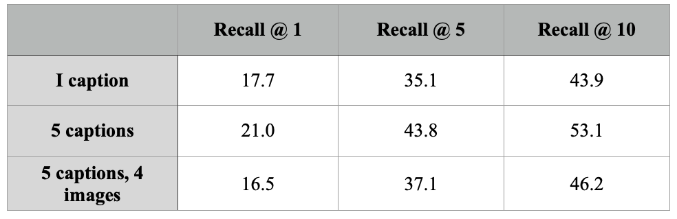

# 1. Introduction

 `TODO: Introduction: An analysis of the paper and its key components. Think about it as a nicely formatted review as you would see on OpenReview.net. It should contain one paragraph of related work as well.`

Large language models (LLMs) have demonstrated impressive performance in natural language processing (NLP) tasks, but they lack the ability to utilize visual cues for learning and reasoning about the real world. Additionally, they are unable to generate images, which is a crucial aspect of multimodal communication. In this paper, a novel approach called FROMAGE is proposed, which leverages a frozen LLM and a visual encoder to enable in-context learning for multimodal tasks.

FROMAGE uses a frozen large language model and a visual encoder. Both models can produce embeddings of different modalities separately, but they cannot interact with each other to explore multi-modal context. FROMAGE proposes a framework for creating an interaction layer between both models. The embeddings generated from the language model are mapped to the visual encoder's vector space using linear transformation to allow LLM to interact with the visual encoder. To generate an embedding for an image using the text input, they propose extending the vocabulary of LLM with the [RET] token. This represents an embedding of an image from the text input, which is learned during training to map the text space into the image space. They use the contrastive loss to learn the mapping. Moreover, with this approach, learning to generate the [RET] token for multi-modal dialogue emerges. Similar to text-visual embedding mapping, they also map the visual embedding to the text space using linear mapping. They use maximum likelihood estimation to learn the mapping.

The paper builds on the shortcomings and prior knowledge that previous work has provided. For example, Flamingo (Alayrac et al., 2022) proposed a visual language model for text generation; however, Flamingo cannot generate images. LIMBeR (Merullo et al., 2022) analyzes pretrained vision and language models and finds that learned representations are functionally equivalent up to a linear transform. Therefore, the authors propose to learn linear mappings for both modalities to be able to generate images while reasoning in a multi-modal setting.

The FROMAGE model is tested using multi-modal tasks, such as image retrieval and image captioning. The results provide evidence that this method is not only feasible for multi-modal learning, but it also maintains the existing capabilities of pre-trained text-only LLMs, such as in-context learning and greater sensitivity to input context. FROMAGE can use the additional descriptions to improve retrieval accuracy (9.0 to 10.4 on R@1). When prompted with the full multimodal context (i.e., 5 images and 4 stories), the model can learn in-context to synthesize plausible story-like text.

The potential of in-context learning piqued our interest, and we decided to explore prompting techniques to exploit the in-context learning capabilities of the FROMAGE model using few-shot learning. A. Beygelzimer et al. (2021) suggested that their work should be seen as a starting point or baseline for the area of research of multimodal few-shot learning. Therefore, we use this paper as a reference for our few-shot learning procedure. In this work, we aim to quantify to what extent the FROMAGE model can adapt to novel and out-of-domain tasks rapidly. Furthermore, we aim to verify that prompting with both visual and language information in few-shot learning is strictly more effective than prompting with language alone.

Our contributions are as follows:

Test the few-shot learning capabilities of the FROMAGE model in a multimodal setting.
Further analyze the multimodal vs. text-only few-shot learning capabilities of the FROMAGE model.
Compare the FROMAGE model to existing benchmark models and quantify the differences.

[In terms of your first contribution, testing the few-shot learning capabilities of FROMAGE in a multimodal setting, what specific tasks do you plan to evaluate the model on? Will you be using existing datasets or creating your own?

Regarding your second contribution, comparing the multimodal and text-only few-shot learning capabilities of FROMAGE, what do you expect to find? Do you anticipate that the model will perform better with multimodal prompts, or do you think that language prompts alone will be sufficient for few-shot learning?

Finally, for your third contribution, which benchmark models do you plan to compare FROMAGE against? What metrics will you use to evaluate performance?
]

# 2. Strengths 

 `TODO: Write.`

# 3. Weaknesses

 `TODO: Write.`

# 4. Reproduction 

In this project, we focused on reproducing the visual storytelling experiment using the VIST dataset, as outlined in section 4.1 in the original paper. Our aim was to evaluate the FROMAGe model's ability to learn in context and transfer knowledge in a zero-shot setting. To streamline the process and save time and computational resources, we chose not to evaluate the Clip model and instead focused solely on assessing the performance of the FROMAGe model. The experiment comprised three different settings, each varying in the input provided: 1 caption, 5 captions, and 5 captions accompanied by 4 images. Since the FROMAGe model is not generative and relies on an embedding data store to match input embeddings during image retrieval, this posed a challenge. The original precomputed embeddings were cc3m embeddings, which the model was trained on. However, to ensure accurate image retrieval for this specific experiment, the model needed to encode the images from the VIST dataset as well. The paper lacked concrete instructions in this regard. To address this issue, we decided to encode the last image (target image) of each story. This ensured that each precomputed embedding corresponded to a specific story that needed to be predicted. By doing so, I ensured that the total probability across the entire test set summed to one, indicating that no precomputed embeddings were left unused. Additionally, we took the initiative to remove any duplicated target images from the dataset. This step prevented the model from retrieving multiple identical images within a single pass, leading to more diverse and meaningful results.

As a result of the aforementioned ambiguities, the reproduced results deviate to some extent from those reported in the paper. Notably, in the experiments involving inputs with 1 caption and 5 captions, the recall values exhibit a consistent trend. The model performs better when provided with 5 captions compared to just 1 caption across all three recall levels. This suggests that having more context benefits the model in understanding the sequential nature of the story, thereby increasing the probability of retrieving the correct image. However, the results for the input of 5 captions and 4 images do not align with expectations. At recall@1, the performance is even worse than when the model is provided with only 1 caption at the same recall level. On the other hand, at recall@5 and recall@10, it performs better than the model with 1 caption but falls short of the performance achieved with 5 captions. Overall, all recall values surpass those reported in the paper. This difference in performance could be attributed to the construction of the precomputed embedding space. In our implementation, we encoded only the target images to serve as the model's search space. Consequently, it becomes relatively easier for the model to retrieve the correct images, potentially leading to higher recall values overall. The following examples at recall@1 illustrate the model outputs:

***Original Story***

***Output -- caption 1***

***Output -- captions 5***

***Output -- captions 5, images 4***

It can be seen from the previous example that model using 5 captions only has the best understanding of story context therefore the retrieved image is most similar to the ground truth while the other two retrieved the same image.

There are a couple of potential factors that could explain the discrepancies between our reproduced results and those reported in the paper. One possible reason is the differences in the experimental settings between our reproduction and the original study. For instance, the construction of precomputed embeddings or variations in how recalls are calculated might have an impact on the outcomes. Another aspect to consider is the potential impact of dataset changes. Over time, some URLs associated with the images in the dataset may have become invalid or inaccessible. While we attempted to mitigate this issue by randomly sampling from the entire dataset for our experiments, it is still possible that these changes in the availability of certain images could have influenced the results to some degree, although the likelihood of significant impact is relatively low. Overall, it is essential to acknowledge these factors and consider them when interpreting the differences between our reproduced results and the findings presented in the original paper. The recall values for all three settings are depicted in the following figure:

# 5. Our Novel Contribution

 `TODO: Change this.`

To test if the FROMAGe model can perform in-context learning we take inspiration from A. Beygelzimer et al. (2021) (Figure 4). We take their dataset - Open Ended Mini ImageNet. It consists of images and their corresponding captions. The interesting part is that the captions use nonsense words, for example 'dax' and 'blicket'. There are different few shot variants in the dataset. This means we can input 1, 3 or 5 images of dax and 1, 3 or 5 images of blicket in the prompt. There are 2500 samples for each few-shot variation and we take 500 random samples and try to retrieve a caption for the last image. We do this experiment to see if FROMAGe is able to perform in-context learning using a few-shot prompt. This did not work out-of-the-box and we thought it might have been because the language model cannot retrieve tokens that are not included in the vocabulary. For this reason, we add the new tokens (in this case 'dax' and 'blicket') to the vocabulary and perform the experiments again, which also did not help. We also experimented with shorter prompts (only 'dax' as prompt for instance), differnt nummber of words to be returned by the model, different temeperature parameters. Additionally, we experimented with 5 shots, which also did not improve the performance. (results examples to be added later)

If time allows, we will also experiment with the model retrieving an image (instead of a caption) of a 'dax' for example. 

# 6. Conclusion

 `TODO: Write.`

# REFERENCES:

@inproceedings{
tsimpoukelli2021multimodal,
title={Multimodal Few-Shot Learning with Frozen Language Models},
author={Maria Tsimpoukelli and Jacob Menick and Serkan Cabi and S. M. Ali Eslami and Oriol Vinyals and Felix Hill},
booktitle={Advances in Neural Information Processing Systems},
editor={A. Beygelzimer and Y. Dauphin and P. Liang and J. Wortman Vaughan},
year={2021},
url={https://openreview.net/forum?id=WtmMyno9Tq2}
}

